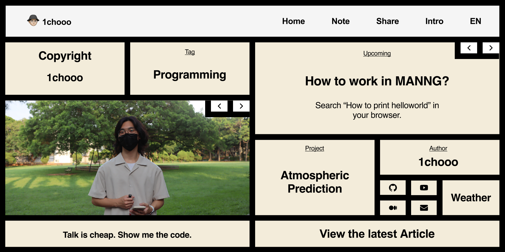
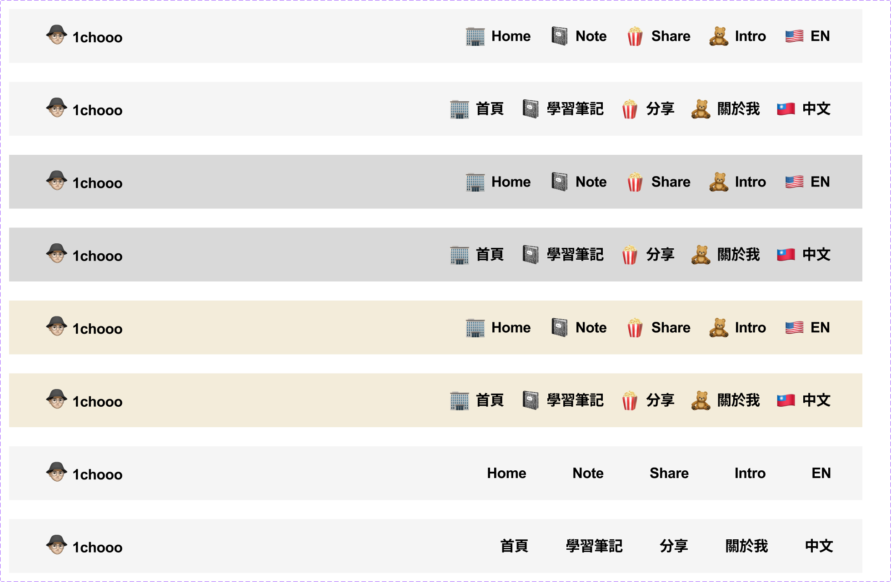
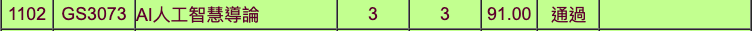
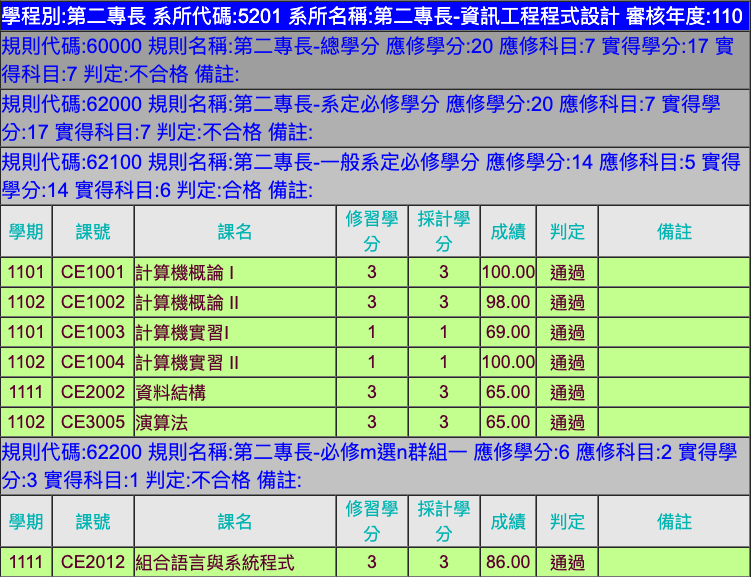

# My Attachments

This is the additonal attachments about the Dcard Machine Learning Intern.

> Table of Contents
> + Introduction to the 2023 Spring Semester Arrangement.
> + My planned projects.
> + Research Topic Participation.
> + List of My Projects.
>   + ML/DL Overview.
>   + Applications Overview.
>   + Gaming Overview.
>   + Webiste Overview.
> + Credits Earned.
> + How to reach out to me?

## Introduction to the 2023 Spring Semester Arrangement.

Course: 
- Programming Language
- Weather and Artificial Intelligence Ⅱ
- Data Visualization

Improving Programming Skills:
- Leetcode
- CPE

## My planned projects.

- NCUAPP Team
  - Frontend
  - Marketing
  - JavaScript
- Mobile App developing 
  - get the data from the wearable devices.
  - Java Language.
- mySQL 

## Research Topic Participation.

- Fool AI/ML and mislead AI/ML to believe some benign devices are malicious ones. | Advisor: Dr. Fu-Hau Hsu
- Use ML/DL to improve the analysis in meteorology with Data Bank for Atmospheric & Hydrologic Research. | Course: Weather and Artificial Intelligence Ⅱ

## List of my Projects.

View on my personal website.

### ML/DL Overview.

### Applications Overview.

### Gaming Overview.

### Website Overview.

* Blog Design.

    link: [click here.](https://github.com/1chooo/blog-design)
    
    * Design of the homepage
        

    * Design of the header.
    

## Credit Earned.

---

> ### How to reach out to me
> - Ins: [@lcho____](https://www.instagram.com/lcho____/)
> - Linkedin: [Hugo ChunHo Lin](https://www.linkedin.com/in/1chooo/)
> - GitHub: [1chooo](https://github.com/1chooo)
> - About me: [1chooo](https://sites.google.com/g.ncu.edu.tw/1chooo)
> - Email: hugo970217@gmail.com

在這個學期的課內，我將會繼續提升我在深度學習的知識，因此修習了 Weather and Artificial Intelligence Ⅱ，在課堂上學習更多特徵處理方式、面對 overfitting 的處理、模型的挑選場合，我也會在我的程式能力繼續提升，所以我將會繼續提升我對程式語言的掌握，在資工系修習了 Principles of Programming Language，這堂課將會提供我更多有關程式設計的相關基礎；另外我也將修習 Data Visualization，提升我對 Data Mining 的能力以及資料可視化的方法，這堂課將會使用網頁的方式呈現資料，所以過程中也可以累積我對 JavaScripts 的熟悉程度。

面試準備的插曲：
這次的實習準備過程滿符合我的個性的，各種方式都有多方嘗試，最大的一個嘗試就是使用英文撰寫正式文件，因為這個寒假跟準備出國留學的朋友聊了天，我從中發現我也想跳脫舒適圈去國外闖蕩，所以對履歷、個人陳述、求職（學）信的認識、參考都是英文的文件，於是就給了自己的一個挑戰，把這場面試當作留學的前戲以及對自己在資訊工程領域的審視，把過往的經歷好好地整理來，並且要能夠描述給他人。
我不只使用了 LaTex，我還使用了 HackMD、Pages 等可以編寫的工具，就像我的日常便會探索新的開發工具、或是提升我專注度的工具，大二的過程學習了 Notion, VSCode, HackMD, Vim 等⋯⋯我不斷地訓練自己與新東西接觸，克復對新事物的恐懼與排斥的感覺，而且有趣的是，我每學玩一個新東西，就喜歡與周遭朋友分享、勸敗，甚至前幾天還被大一室友揶揄：「群賀，你學新工具的速度太快了，你每介紹我一個，我才剛上手，你就又跟我講了一個更好用的工具。」